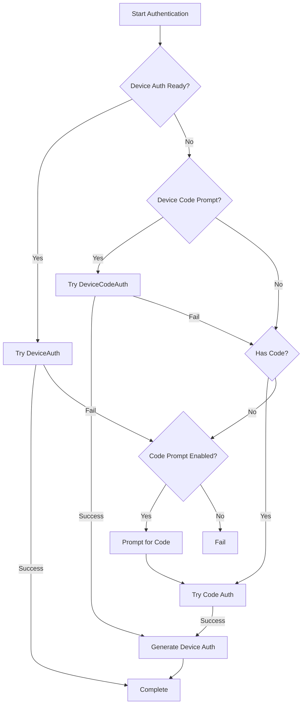

`AdvancedAuth` is a flexible authentication method that tries multiple strategies automatically and generates device auth credentials for future use.

## Why Use AdvancedAuth?

- Automatically tries multiple authentication methods in order
- Generates device auth credentials automatically
- Perfect for getting started quickly
- Handles authentication fallbacks intelligently
- Dispatches device auth details for easy storage

## How It Works

AdvancedAuth tries authentication in this order:

1. **DeviceAuth** - If `device_id`, `account_id`, and `secret` are provided
2. **DeviceCodeAuth** - If `prompt_device_code` is `True` (opens browser)
3. **ExchangeCodeAuth** - If `exchange_code` is provided or `prompt_exchange_code` is `True`
4. **AuthorizationCodeAuth** - If `authorization_code` is provided or `prompt_authorization_code` is `True`

After successful authentication (if not using DeviceAuth), it automatically generates and dispatches device auth credentials.

## Quick Start Example

This is the recommended way to get started with rebootpy:

```python
import rebootpy
import json
import os
from rebootpy.ext import commands

filename = 'device_auths.json'

def get_device_auth_details():
    if os.path.isfile(filename):
        with open(filename, 'r') as fp:
            return json.load(fp)
    return {}

def store_device_auth_details(details):
    with open(filename, 'w') as fp:
        json.dump(details, fp)

device_auth_details = get_device_auth_details()

bot = commands.Bot(
    command_prefix='!',
    auth=rebootpy.AdvancedAuth(
        prompt_device_code=True,
        open_link_in_browser=True,
        **device_auth_details
    )
)

@bot.event
async def event_device_auth_generate(details):
    store_device_auth_details(details)
    print('Device auth details saved!')

@bot.event
async def event_ready():
    print(f'Bot ready as {bot.user.display_name} ({bot.user.id})')

bot.run()
```

**What happens:**
1. First run: Opens browser for login, generates device auth, saves to file
2. Subsequent runs: Uses saved device auth, no login required

## Parameters

### Device Auth Parameters

<ParamField path="device_id" type="str">
  The device id to use for login. If provided along with `account_id` and `secret`, DeviceAuth will be tried first.
</ParamField>

<ParamField path="account_id" type="str">
  The account id to use for login. Required for DeviceAuth.
</ParamField>

<ParamField path="secret" type="str">
  The secret to use for login. Required for DeviceAuth.
</ParamField>

### Code Parameters

<ParamField path="exchange_code" type="Union[str, Callable, Awaitable]">
  The exchange code or a function/coroutine that returns it. If provided, ExchangeCodeAuth will be tried.
</ParamField>

<ParamField path="authorization_code" type="Union[str, Callable, Awaitable]">
  The authorization code or a function/coroutine that returns it. If provided, AuthorizationCodeAuth will be tried.
</ParamField>

### Prompt Parameters

<ParamField path="prompt_device_code" type="bool" default={true}>
  If `True`, DeviceCodeAuth will be tried (opens browser for login). This is the recommended method for first-time setup.
</ParamField>

<ParamField path="open_link_in_browser" type="bool" default={true}>
  Whether to automatically open the device code link in the browser. Only applies when `prompt_device_code` is `True`.
</ParamField>

<ParamField path="prompt_exchange_code" type="bool" default={false}>
  If `True` and no exchange code is provided, you'll be prompted to enter one in the console.
  
  <Warning>
    Cannot be `True` at the same time as `prompt_authorization_code`.
  </Warning>
</ParamField>

<ParamField path="prompt_authorization_code" type="bool" default={false}>
  If `True` and no authorization code is provided, you'll be prompted to enter one in the console.
  
  <Warning>
    Cannot be `True` at the same time as `prompt_exchange_code`.
  </Warning>
</ParamField>

### Fallback Parameters

<ParamField path="prompt_code_if_invalid" type="bool" default={false}>
  Whether to prompt for a code if device auth details are invalid. Only works if `prompt_exchange_code` or `prompt_authorization_code` is `True`.
</ParamField>

<ParamField path="prompt_code_if_throttled" type="bool" default={false}>
  Whether to prompt for a code if you receive a throttling response. Only works if `prompt_exchange_code` or `prompt_authorization_code` is `True`.
</ParamField>

### Management Parameters

<ParamField path="delete_existing_device_auths" type="bool" default={false}>
  Whether to delete all existing device auths when a new one is created.
</ParamField>

<ParamField path="ios_token" type="str" default="auto">
  The main Fortnite token to use. You generally don't need to set this.
</ParamField>

<ParamField path="token_type" type="str" default="eg1">
  The token type to use. Only change if you know what you're doing.
</ParamField>

## Events

### event_device_auth_generate

Dispatched when device auth credentials are generated. **You should store these details for future use.**

```python
@bot.event
async def event_device_auth_generate(details: dict):
    """Called when device auth is generated.
    
    Parameters
    ----------
    details : dict
        Dictionary with keys: 'device_id', 'account_id', 'secret'
    """
    print(f"Device ID: {details['device_id']}")
    print(f"Account ID: {details['account_id']}")
    print(f"Secret: {details['secret']}")
    
    # Store these values!
    with open('device_auths.json', 'w') as fp:
        json.dump(details, fp)
```

### event_device_code_generated

Dispatched when a device code login link is generated. Only if you want custom handling.

```python
@bot.event
async def event_device_code_generated(link: str):
    """Called when device code link is ready.
    
    Parameters
    ----------
    link : str
        The URL the user should visit to login
    """
    print(f'Login at: {link}')
    # Or send to Discord, display in GUI, etc.
```

## Common Usage Patterns

### First Time Setup (Recommended)

```python
import rebootpy
from rebootpy.ext import commands

bot = commands.Bot(
    command_prefix='!',
    auth=rebootpy.AdvancedAuth(
        prompt_device_code=True  # Opens browser for easy login
    )
)

@bot.event
async def event_device_auth_generate(details):
    print('Save these details for future use:')
    print(f"Device ID: {details['device_id']}")
    print(f"Account ID: {details['account_id']}")
    print(f"Secret: {details['secret']}")

bot.run()
```

### With Persistent Storage

```python
import rebootpy
import json
import os
from rebootpy.ext import commands

filename = 'device_auths.json'

def get_device_auth_details():
    if os.path.isfile(filename):
        with open(filename, 'r') as fp:
            return json.load(fp)
    return {}

def store_device_auth_details(details):
    with open(filename, 'w') as fp:
        json.dump(details, fp)

device_auth_details = get_device_auth_details()

bot = commands.Bot(
    command_prefix='!',
    auth=rebootpy.AdvancedAuth(
        prompt_device_code=True,
        **device_auth_details
    )
)

@bot.event
async def event_device_auth_generate(details):
    store_device_auth_details(details)

bot.run()
```

### With Authorization Code Fallback

```python
import rebootpy
from rebootpy.ext import commands

bot = commands.Bot(
    command_prefix='!',
    auth=rebootpy.AdvancedAuth(
        prompt_device_code=True,
        prompt_authorization_code=True,  # Fallback if device code fails
        prompt_code_if_invalid=True  # Prompt for code if device auth invalid
    )
)
```

### With Environment Variables

```python
import rebootpy
import os
from rebootpy.ext import commands

bot = commands.Bot(
    command_prefix='!',
    auth=rebootpy.AdvancedAuth(
        device_id=os.getenv('DEVICE_ID'),
        account_id=os.getenv('ACCOUNT_ID'),
        secret=os.getenv('DEVICE_SECRET'),
        prompt_device_code=True  # Fallback if env vars not set
    )
)
```

### Clean Up Old Device Auths

```python
import rebootpy
from rebootpy.ext import commands

bot = commands.Bot(
    command_prefix='!',
    auth=rebootpy.AdvancedAuth(
        prompt_device_code=True,
        delete_existing_device_auths=True  # Remove old device auths
    )
)
```

## Advanced Examples

### Custom Code Provider Function

```python
import rebootpy
from rebootpy.ext import commands

async def get_authorization_code():
    # Your custom logic to get code
    # Could fetch from database, API, etc.
    import aiohttp
    async with aiohttp.ClientSession() as session:
        async with session.get('https://your-api.com/get_code') as resp:
            data = await resp.json()
            return data['code']

bot = commands.Bot(
    command_prefix='!',
    auth=rebootpy.AdvancedAuth(
        authorization_code=get_authorization_code,  # Async function
        prompt_device_code=True  # Fallback
    )
)
```

### Multiple Accounts

```python
import rebootpy
import json
import os
from rebootpy.ext import commands

def load_account(account_name):
    filename = f'device_auths_{account_name}.json'
    if os.path.isfile(filename):
        with open(filename, 'r') as fp:
            return json.load(fp)
    return {}

def save_account(account_name, details):
    filename = f'device_auths_{account_name}.json'
    with open(filename, 'w') as fp:
        json.dump(details, fp)

account_name = 'main_bot'
device_auth = load_account(account_name)

bot = commands.Bot(
    command_prefix='!',
    auth=rebootpy.AdvancedAuth(
        prompt_device_code=True,
        **device_auth
    )
)

@bot.event
async def event_device_auth_generate(details):
    save_account(account_name, details)

bot.run()
```

## Authentication Flow

Here's what happens when you use AdvancedAuth:



## Attributes

<ParamField path="authorization" type="str">
  The Authorization header for use with Fortnite endpoints.
</ParamField>

<ParamField path="account_id" type="str">
  The account ID of the authenticated user.
</ParamField>

<ParamField path="device_id" type="str">
  The device ID after authentication completes.
</ParamField>

<ParamField path="secret" type="str">
  The device auth secret after authentication completes.
</ParamField>

## Common Errors

### Both Prompt Types Enabled

```python
# This will raise ValueError:
auth=rebootpy.AdvancedAuth(
    prompt_exchange_code=True,
    prompt_authorization_code=True  # Can't both be True!
)
```

**Solution:** Choose only one prompt type.

### Device Auth Invalid

If stored device auth is invalid:

1. With `prompt_code_if_invalid=True`: You'll be prompted for a code
2. Without: An `AuthException` is raised

**Solution:** Delete old credentials and authenticate again.

### No Authentication Method Available

If you don't provide any authentication method:

```python
# This will fail - no auth method enabled:
auth=rebootpy.AdvancedAuth()
```

**Solution:** Enable at least one prompt or provide credentials.

## Best Practices

1. **Always handle `event_device_auth_generate`** to store credentials
2. **Use `prompt_device_code=True`** for easiest setup
3. **Store credentials securely** (not in code)
4. **Use environment variables** or encrypted storage for production
5. **Enable fallback prompts** for error recovery
6. **Clean up old device auths** periodically with `delete_existing_device_auths`

## Migration to DeviceAuth

Once you have device auth credentials, you can switch to pure DeviceAuth for cleaner code:

```python
# After using AdvancedAuth and saving credentials:
import rebootpy
import json
from rebootpy.ext import commands

with open('device_auths.json', 'r') as fp:
    details = json.load(fp)

bot = commands.Bot(
    command_prefix='!',
    auth=rebootpy.DeviceAuth(**details)  # Simpler!
)
```

See [DeviceAuth](/auth/device-auth) for more details.
