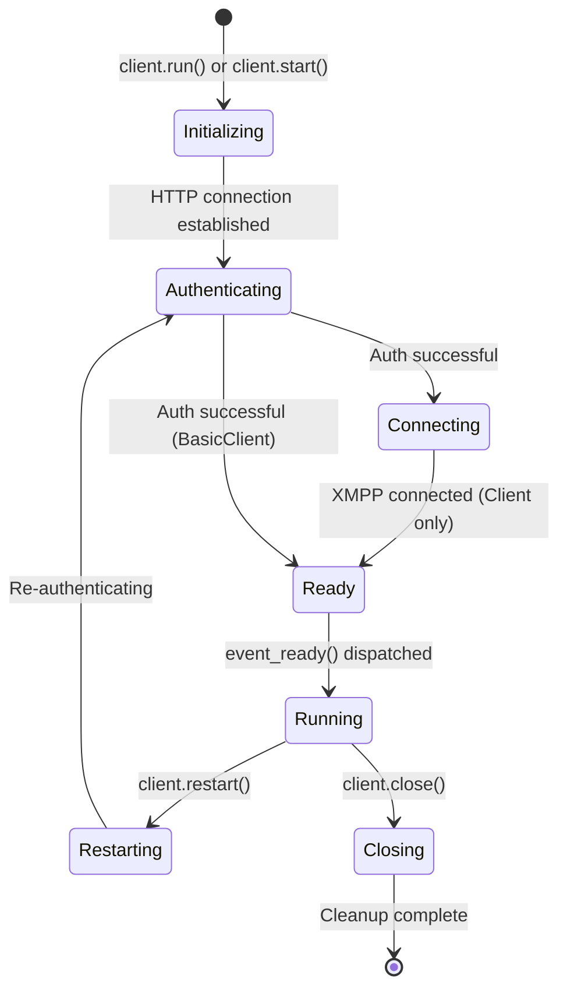

## Overview

rebootpy provides two main client classes for interacting with Fortnite:

- **`BasicClient`** - A stripped-down client for simple API requests
- **`Client`** - A full-featured client with XMPP support for parties, friends, and messaging

## BasicClient

`BasicClient` is designed for lightweight applications that only need to make API requests without real-time features.

### Features

- User and stats fetching
- Party fetching (read-only)
- Authentication management
- HTTP requests

### Limitations

- **No** party management (except `fetch_party()`)
- **No** friends system
- **No** XMPP features (messaging, most events)

### Supported Events

```python
event_ready()
event_before_start()
event_before_close()
event_restart()
event_device_auth_generate()
event_auth_refresh()
```

### Example Usage

```python
import rebootpy
import asyncio

client = rebootpy.BasicClient(
    auth=rebootpy.AdvancedAuth(
        prompt_device_code=True
    )
)

@client.event
async def event_ready():
    print(f'Logged in as {client.user.display_name}')
    
    # Fetch user stats
    user = await client.fetch_user('Ninja')
    print(f'Found user: {user.display_name}')
    
    # Close when done
    await client.close()

client.run()
```

## Client

The full `Client` class extends `BasicClient` with complete XMPP support for social features.

### Additional Features

- **Friends management** - Add, remove, and manage friends
- **Party system** - Create, join, and manage parties
- **Real-time messaging** - Send and receive messages
- **Presence tracking** - Monitor friend status and activity
- **Rich events** - Comprehensive event system for real-time updates

### Key Parameters

<ParamField path="auth" type="Auth" required>
  Authentication method (e.g., `AdvancedAuth`, `DeviceAuth`)
</ParamField>

<ParamField path="cache_users" type="bool" default="True">
  Whether to cache User objects in memory
</ParamField>

<ParamField path="build" type="str">
  Fortnite build version (defaults to latest known version)
</ParamField>

<ParamField path="os" type="str" default="Windows/10.0.19045.1.768.64bit">
  OS version string for user agent
</ParamField>

<ParamField path="kill_other_sessions" type="bool" default="True">
  Kill other active sessions when logging in
</ParamField>

### Starting the Client

#### Option 1: Using `run()` (Blocking)

```python
import rebootpy

client = rebootpy.Client(
    auth=rebootpy.AdvancedAuth(
        prompt_device_code=True
    )
)

@client.event
async def event_ready():
    print(f'Client ready as {client.user.display_name}')

client.run()  # Blocks until client closes
```

#### Option 2: Using `start()` (Context Manager)

```python
import rebootpy
import asyncio

async def main():
    client = rebootpy.Client(
        auth=rebootpy.AdvancedAuth(
            prompt_device_code=True
        )
    )
    
    async with client.start():
        # Do something quick
        user = await client.fetch_user('Ninja')
        print(user.display_name)
        
    # Client automatically closes when exiting context

asyncio.run(main())
```

#### Option 3: Keep Running Forever

```python
async def main():
    client = rebootpy.Client(
        auth=rebootpy.AdvancedAuth(
            prompt_device_code=True
        )
    )
    
    async with client.start() as future:
        # Client is ready, do initial setup
        print(f'Ready as {client.user.display_name}')
        
        # Wait forever (nothing after this runs)
        await future

asyncio.run(main())
```

## Client Lifecycle



## Common Client Methods

### User Methods

```python
# Fetch a single user
user = await client.fetch_user('Ninja')
user = await client.fetch_user('4735ce9132924caf8a5b17789b40f79c')

# Fetch multiple users
users = await client.fetch_users(['Ninja', 'SypherPK'])

# Search users by prefix
entries = await client.search_users(
    'Ninja',
    platform=rebootpy.UserSearchPlatform.EPIC
)
```

### Stats Methods

```python
# Fetch BR stats
stats = await client.fetch_br_stats('user-id')
print(f'Wins: {stats.total_wins}')

# Fetch ranked stats
ranks = await client.fetch_ranked_stats(
    user_id='user-id',
    season=rebootpy.Season.C5S3
)

# Fetch battlepass level
level = await client.fetch_battlepass_level(
    user_id='user-id',
    season=rebootpy.Season.C5S3
)
```

### Party Methods (Client only)

```python
# Access current party
party = client.party

# Set party privacy
await party.set_privacy(rebootpy.PartyPrivacy.PRIVATE)

# Fetch a party by ID
party = await client.fetch_party('party-id')
```

### Friend Methods (Client only)

```python
# Get all friends
friends = client.friends

# Add a friend
await client.add_friend('user-id')

# Remove a friend
await client.remove_or_decline_friend('user-id')

# Get a specific friend
friend = client.get_friend('user-id')
```

## Running Multiple Clients

rebootpy supports running multiple clients simultaneously:

```python
import rebootpy

client1 = rebootpy.Client(
    auth=rebootpy.DeviceAuth(
        device_id='device-id-1',
        account_id='account-id-1',
        secret='secret-1'
    )
)

client2 = rebootpy.Client(
    auth=rebootpy.DeviceAuth(
        device_id='device-id-2',
        account_id='account-id-2',
        secret='secret-2'
    )
)

# Function called when each client is ready
async def ready_callback(client):
    print(f'{client.user.display_name} is ready!')

# Function called when all clients are ready
async def all_ready_callback():
    print('All clients are ready!')

rebootpy.run_multiple(
    [client1, client2],
    gap_timeout=0.2,  # Delay between starting clients
    ready_callback=ready_callback,
    all_ready_callback=all_ready_callback
)
```

## Error Handling

```python
import rebootpy
from rebootpy.errors import (
    AuthException,
    HTTPException,
    NotFound,
    Forbidden
)

client = rebootpy.Client(
    auth=rebootpy.AdvancedAuth(
        prompt_device_code=True
    )
)

@client.event
async def event_ready():
    try:
        user = await client.fetch_user('InvalidUser123')
    except NotFound:
        print('User not found')
    except HTTPException as e:
        print(f'HTTP error: {e}')

try:
    client.run()
except AuthException as e:
    print(f'Authentication failed: {e}')
```

## Best Practices

<CardGroup cols={2}>
  <Card title="Use BasicClient for simple tasks" icon="code">
    If you only need stats or user lookups, use `BasicClient` to save resources
  </Card>
  <Card title="Handle authentication errors" icon="shield-check">
    Always wrap `client.run()` in try-except to catch `AuthException`
  </Card>
  <Card title="Cache users appropriately" icon="database">
    Disable `cache_users` for bots handling thousands of users
  </Card>
  <Card title="Graceful shutdown" icon="power-off">
    Use `client.close()` or context managers for proper cleanup
  </Card>
</CardGroup>

## Next Steps

<CardGroup cols={2}>
  <Card title="Events" href="/concepts/events" icon="bolt">
    Learn about the event system and handlers
  </Card>
  <Card title="Friends" href="/concepts/friends" icon="users">
    Manage friends and friend requests
  </Card>
  <Card title="Parties" href="/concepts/parties" icon="people-group">
    Create and manage party lobbies
  </Card>
  <Card title="Messages" href="/concepts/messages" icon="message">
    Send and receive messages
  </Card>
</CardGroup>