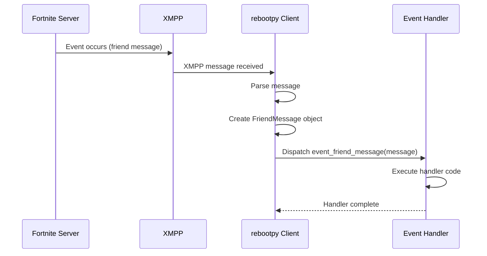

## Overview

rebootpy uses an event-driven architecture to notify your application about real-time changes. Events are dispatched when friends come online, messages are received, party members join, and more.

## Registering Event Handlers

There are three ways to register event handlers:

### 1. Using the `@event` Decorator

```python
import rebootpy

client = rebootpy.Client(auth=...)

@client.event
async def event_ready():
    print(f'Bot ready as {client.user.display_name}')

@client.event
async def event_friend_message(message):
    print(f'{message.author.display_name}: {message.content}')
    await message.reply('Thanks for your message!')
```

### 2. Using Custom Event Names

```python
@client.event('friend_message')
async def my_message_handler(message):
    await message.reply('Hello!')

@client.event('party_member_join')
async def on_member_join(member):
    print(f'{member.display_name} joined the party')
```

### 3. Using `add_event_handler()`

```python
async def handle_ready():
    print('Client is ready')

async def handle_message(message):
    await message.reply('Hi!')

client.add_event_handler('ready', handle_ready)
client.add_event_handler('friend_message', handle_message)
```

## Event Naming Convention

When using the decorator without arguments, events must follow the naming pattern:

```python
# Correct
@client.event
async def event_ready():
    pass

@client.event
async def event_friend_message(message):
    pass

# Wrong - will raise TypeError
@client.event
async def ready():  # Missing 'event_' prefix
    pass
```

## Core Events

### Client Events

#### `event_ready()`

Called when the client is fully initialized and ready.

```python
@client.event
async def event_ready():
    print(f'Logged in as {client.user.display_name}')
    print(f'Client ID: {client.user.id}')
    print(f'Friends: {len(client.friends)}')
```

#### `event_before_start()`

Called before the client starts. Useful for setup tasks.

```python
@client.event
async def event_before_start():
    print('Setting up database connections...')
    # Setup code here
```

#### `event_before_close()`

Called before the client closes. Useful for cleanup.

```python
@client.event
async def event_before_close():
    print('Saving data and closing connections...')
    # Cleanup code here
```

#### `event_restart()`

Called when the client restarts (Client only).

```python
@client.event
async def event_restart():
    print('Client restarted successfully')
```

#### `event_device_auth_generate(details)`

Called when device authentication is generated.

**Parameters:**
- `details` (dict) - Device auth details to store

```python
import json

@client.event
async def event_device_auth_generate(details):
    with open('device_auths.json', 'w') as f:
        json.dump(details, f)
    print('Device auth saved!')
```

### Friend Events (Client only)

#### `event_friend_message(message)`

Called when a friend message is received.

**Parameters:**
- `message` (FriendMessage) - The message object

```python
@client.event
async def event_friend_message(message):
    print(f'{message.author.display_name}: {message.content}')
    
    if message.content.lower() == 'hello':
        await message.reply('Hi there!')
```

#### `event_friend_add(friend)`

Called when a friend is added.

**Parameters:**
- `friend` (Friend) - The friend that was added

```python
@client.event
async def event_friend_add(friend):
    print(f'Added {friend.display_name} as a friend')
    await friend.send('Thanks for adding me!')
```

#### `event_friend_remove(friend)`

Called when a friend is removed.

**Parameters:**
- `friend` (Friend) - The friend that was removed

```python
@client.event
async def event_friend_remove(friend):
    print(f'{friend.display_name} is no longer a friend')
```

#### `event_friend_request(request)`

Called when a friend request is received.

**Parameters:**
- `request` (IncomingPendingFriend) - The incoming friend request

```python
@client.event
async def event_friend_request(request):
    print(f'Friend request from {request.display_name}')
    await request.accept()
```

#### `event_friend_presence(before, after)`

Called when a friend's presence changes.

**Parameters:**
- `before` (Presence | None) - Previous presence (None if friend just came online)
- `after` (Presence) - New presence

```python
@client.event
async def event_friend_presence(before, after):
    friend = after.friend
    
    if before is None or not before.available:
        print(f'{friend.display_name} came online')
    elif not after.available:
        print(f'{friend.display_name} went offline')
    else:
        # Status changed while online
        if before.party.id != after.party.id:
            print(f'{friend.display_name} joined a new party')
```

### Party Events (Client only)

#### `event_party_message(message)`

Called when a party message is received.

**Parameters:**
- `message` (PartyMessage) - The message object

```python
@client.event
async def event_party_message(message):
    print(f'[{message.party.id}] {message.author.display_name}: {message.content}')
    
    if message.author.id != client.user.id:
        await message.reply(f'You said: {message.content}')
```

#### `event_party_member_join(member)`

Called when a member joins the party.

**Parameters:**
- `member` (PartyMember) - The member who joined

```python
@client.event
async def event_party_member_join(member):
    print(f'{member.display_name} joined the party')
    await client.party.send(f'Welcome {member.display_name}!')
```

#### `event_party_member_leave(member)`

Called when a member leaves the party.

**Parameters:**
- `member` (PartyMember) - The member who left

```python
@client.event
async def event_party_member_leave(member):
    print(f'{member.display_name} left the party')
```

#### `event_party_member_promote(old_leader, new_leader)`

Called when party leadership changes.

**Parameters:**
- `old_leader` (PartyMember) - Previous party leader
- `new_leader` (PartyMember) - New party leader

```python
@client.event
async def event_party_member_promote(old_leader, new_leader):
    print(f'{new_leader.display_name} is now the party leader')
    
    if new_leader.id == client.user.id:
        await client.party.set_privacy(rebootpy.PartyPrivacy.PUBLIC)
```

#### `event_party_member_kick(member)`

Called when a member is kicked from the party.

**Parameters:**
- `member` (PartyMember) - The member who was kicked

```python
@client.event
async def event_party_member_kick(member):
    print(f'{member.display_name} was kicked from the party')
```

#### `event_party_member_disconnect(member)`

Called when a member disconnects from the party.

**Parameters:**
- `member` (PartyMember) - The member who disconnected

```python
@client.event
async def event_party_member_disconnect(member):
    print(f'{member.display_name} disconnected')
```

#### `event_party_member_update(member)`

Called when a party member's meta is updated (outfit, emote, etc.).

**Parameters:**
- `member` (PartyMember) - The member who was updated

```python
@client.event
async def event_party_member_update(member):
    print(f'{member.display_name} updated their loadout')
    print(f'Outfit: {member.outfit}')
```

#### `event_party_update(party)`

Called when party configuration is updated.

**Parameters:**
- `party` (ClientParty) - The party that was updated

```python
@client.event
async def event_party_update(party):
    print(f'Party updated: {party.member_count}/{party.max_size} members')
```

#### `event_party_invitation(invitation)`

Called when the client receives a party invitation.

**Parameters:**
- `invitation` (ReceivedPartyInvitation) - The invitation object

```python
@client.event
async def event_party_invitation(invitation):
    print(f'Invited to party by {invitation.sender.display_name}')
    await invitation.accept()
```

## Using `wait_for()`

You can wait for specific events to occur:

```python
@client.event
async def event_friend_message(message):
    await message.reply('Say "hello"!')
    
    def check(m):
        return m.author.id == message.author.id and m.content.lower() == 'hello'
    
    try:
        msg = await client.wait_for('friend_message', check=check, timeout=60)
        await msg.reply(f'Hello {msg.author.display_name}!')
    except asyncio.TimeoutError:
        await message.reply('You took too long!')
```

### Wait for Party Promotion

```python
@client.event
async def event_party_member_join(member):
    if member.id != client.user.id:
        return
    
    def check(m):
        return m.id == client.user.id
    
    try:
        await client.wait_for('party_member_promote', check=check, timeout=120)
        await client.party.set_custom_key('my_custom_key')
    except asyncio.TimeoutError:
        await client.party.send('Please promote me!')
```

## Multiple Event Handlers

You can register multiple handlers for the same event:

```python
@client.event
async def event_friend_message(message):
    print(f'Handler 1: {message.content}')

@client.event('friend_message')
async def log_message(message):
    # Log to database
    await save_to_database(message)

@client.event('friend_message')
async def auto_reply(message):
    if 'hello' in message.content.lower():
        await message.reply('Hi!')
```

## Removing Event Handlers

```python
async def my_handler(message):
    await message.reply('Hello!')

client.add_event_handler('friend_message', my_handler)

# Later, remove it
client.remove_event_handler('friend_message', my_handler)
```

## Event Flow Diagram



## Best Practices

<CardGroup cols={2}>
  <Card title="Use async/await" icon="hourglass">
    All event handlers must be async functions and use `await` for async operations
  </Card>
  <Card title="Handle errors" icon="triangle-exclamation">
    Wrap event handler code in try-except to prevent crashes
  </Card>
  <Card title="Keep handlers fast" icon="bolt">
    Don't block the event loop with long-running operations
  </Card>
  <Card title="Use wait_for() wisely" icon="clock">
    Always set timeouts to avoid waiting forever
  </Card>
</CardGroup>

## Common Patterns

### Auto-accept Friend Requests

```python
@client.event
async def event_friend_request(request):
    await request.accept()
    print(f'Accepted friend request from {request.display_name}')
```

### Command Handler Pattern

```python
@client.event
async def event_friend_message(message):
    if not message.content.startswith('!'):
        return
    
    command = message.content[1:].split()[0].lower()
    
    if command == 'hello':
        await message.reply('Hello!')
    elif command == 'stats':
        stats = await client.fetch_br_stats(message.author.id)
        await message.reply(f'Wins: {stats.total_wins}')
```

### Party Auto-join

```python
@client.event
async def event_party_invitation(invitation):
    # Only accept invitations from friends
    if client.get_friend(invitation.sender.id):
        await invitation.accept()
```

## Next Steps

<CardGroup cols={2}>
  <Card title="Friends" href="/concepts/friends" icon="users">
    Learn about friend management
  </Card>
  <Card title="Parties" href="/concepts/parties" icon="people-group">
    Understand party system mechanics
  </Card>
  <Card title="Messages" href="/concepts/messages" icon="message">
    Handle friend and party messages
  </Card>
  <Card title="Presence" href="/concepts/presence" icon="signal">
    Track friend presence and status
  </Card>
</CardGroup>