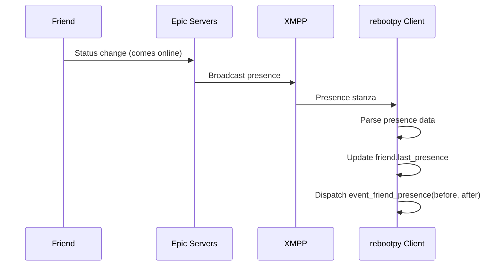

## Overview

Presence data provides real-time information about a friend's status, including:
- Online/offline status
- Current platform
- Current game mode and playlist
- Party information
- Gameplay statistics (kills, players alive, etc.)

## Presence Class

The `Presence` class represents a friend's current status.

### Key Attributes

<ParamField path="available" type="bool">
  Whether the friend is online
</ParamField>

<ParamField path="away" type="AwayStatus">
  Friend's away status
</ParamField>

<ParamField path="friend" type="Friend">
  The friend this presence belongs to
</ParamField>

<ParamField path="platform" type="Platform">
  Platform the friend is on (WIN, PSN, XBL, etc.)
</ParamField>

<ParamField path="received_at" type="datetime">
  When this presence was received
</ParamField>

<ParamField path="status" type="str">
  Friend's custom status message
</ParamField>

<ParamField path="playing" type="bool">
  Whether friend is playing
</ParamField>

<ParamField path="joinable" type="bool">
  Whether friend's game is joinable
</ParamField>

<ParamField path="session_id" type="str">
  Current game session ID (None if not in game)
</ParamField>

<ParamField path="party" type="PresenceParty">
  Friend's party information
</ParamField>

<ParamField path="gameplay_stats" type="PresenceGameplayStats">
  Current gameplay statistics (None if not in match)
</ParamField>

## Accessing Presence

### Get Last Presence

```python
friend = client.get_friend('user-id')
presence = friend.last_presence

if presence:
    print(f'Status: {presence.status}')
    print(f'Online: {presence.available}')
    print(f'Platform: {presence.platform.name}')
else:
    print('No presence data available')
```

### Get Presence from Cache

```python
presence = client.get_presence('user-id')

if presence:
    print(f'Found cached presence for user')
```

## Presence Events

### Friend Presence Changed

```python
@client.event
async def event_friend_presence(before, after):
    friend = after.friend
    
    # Friend came online
    if before is None or not before.available:
        if after.available:
            print(f'{friend.display_name} came online')
            print(f'Platform: {after.platform.name}')
            print(f'Status: {after.status}')
    
    # Friend went offline
    elif not after.available:
        print(f'{friend.display_name} went offline')
    
    # Status changed while online
    else:
        if before.status != after.status:
            print(f'{friend.display_name} changed status to: {after.status}')
```

## Online Status Checking

```python
friend = client.get_friend('user-id')

if friend.is_online():
    print(f'{friend.display_name} is online')
    print(f'Platform: {friend.platform.name}')
else:
    print(f'{friend.display_name} is offline')
    if friend.last_logout:
        print(f'Last seen: {friend.last_logout}')
```

## Party Information

The `PresenceParty` class provides information about a friend's party.

### Party Attributes

```python
@client.event
async def event_friend_presence(before, after):
    if after.party:
        party = after.party
        
        print(f'Party ID: {party.id}')
        print(f'Private: {party.private}')
        print(f'Player Count: {party.playercount}')
        print(f'Platform: {party.platform.name}')
        print(f'Build ID: {party.build_id}')
```

### Check if Private

```python
@client.event
async def event_friend_presence(before, after):
    if after.party:
        if after.party.private:
            print('Friend is in a private party')
        else:
            print('Friend is in a public party')
            # Can join
            await after.party.join()
```

### Join Friend's Party

```python
import rebootpy
from rebootpy.errors import PartyError, Forbidden

@client.event
async def event_friend_presence(before, after):
    friend = after.friend
    
    # Check if friend just came online
    if (before is None or not before.available) and after.available:
        if after.party and not after.party.private:
            try:
                party = await after.party.join()
                print(f'Joined {friend.display_name}\'s party')
            except PartyError:
                print('Party not found')
            except Forbidden:
                print('Party became private')
```

## Gameplay Statistics

The `PresenceGameplayStats` class provides real-time game statistics.

### Available Stats

```python
@client.event
async def event_friend_presence(before, after):
    if after.gameplay_stats:
        stats = after.gameplay_stats
        
        print(f'Players Alive: {stats.players_alive}')
        print(f'Kills: {stats.kills}')
        print(f'Playlist: {stats.playlist}')
        print(f'Fell to Death: {stats.fell_to_death}')
```

### Track Friend's Match Progress

```python
@client.event
async def event_friend_presence(before, after):
    friend = after.friend
    
    # Check if gameplay stats exist
    if after.gameplay_stats:
        stats = after.gameplay_stats
        
        # Check if kills changed
        if before and before.gameplay_stats:
            old_kills = before.gameplay_stats.kills
            new_kills = stats.kills
            
            if new_kills > old_kills:
                print(f'{friend.display_name} got a kill! Total: {new_kills}')
        
        # Check players remaining
        if stats.players_alive <= 10:
            print(f'{friend.display_name} is in top 10! ({stats.players_alive} left)')
```

## Presence Properties

### Platform Detection

```python
import rebootpy

@client.event
async def event_friend_presence(before, after):
    if after.available:
        platform = after.platform
        
        if platform == rebootpy.Platform.WINDOWS:
            print('Friend is on PC')
        elif platform == rebootpy.Platform.PLAYSTATION:
            print('Friend is on PlayStation')
        elif platform == rebootpy.Platform.XBOX:
            print('Friend is on Xbox')
        elif platform == rebootpy.Platform.SWITCH:
            print('Friend is on Nintendo Switch')
        elif platform == rebootpy.Platform.MOBILE:
            print('Friend is on Mobile')
```

### Playlist Information

```python
@client.event
async def event_friend_presence(before, after):
    if after.playlist:
        print(f'Playlist: {after.playlist}')
        
        if 'solo' in after.playlist.lower():
            print('Playing Solos')
        elif 'duo' in after.playlist.lower():
            print('Playing Duos')
        elif 'squad' in after.playlist.lower():
            print('Playing Squads')
```

### Party Size Tracking

```python
@client.event
async def event_friend_presence(before, after):
    if after.party_size and after.max_party_size:
        print(f'Party: {after.party_size}/{after.max_party_size}')
        
        if after.party_size == 1:
            print('Friend is playing alone')
        elif after.party_size == after.max_party_size:
            print('Friend\'s party is full')
```

## Waiting for Presence

### Wait for Friend to Come Online

```python
friend = client.get_friend('user-id')

print(f'Waiting for {friend.display_name} to come online...')
await friend.wait_until_online()
print(f'{friend.display_name} is now online!')

# Send a message
await friend.send('Hey! I saw you came online!')
```

### Wait for Friend to Go Offline

```python
friend = client.get_friend('user-id')

print(f'Waiting for {friend.display_name} to go offline...')
await friend.wait_until_offline()
print(f'{friend.display_name} went offline')
```

### Wait with Timeout

```python
import asyncio

friend = client.get_friend('user-id')

try:
    # Wait up to 5 minutes
    await asyncio.wait_for(
        friend.wait_until_online(),
        timeout=300
    )
    print('Friend came online!')
except asyncio.TimeoutError:
    print('Friend did not come online within 5 minutes')
```

## Advanced Patterns

### Auto-join When Friend Plays Specific Mode

```python
@client.event
async def event_friend_presence(before, after):
    friend = after.friend
    
    # Check if friend is in a duo game
    if after.playlist and 'duo' in after.playlist.lower():
        if after.party and not after.party.private:
            if after.party.playercount < 2:  # Has room
                await after.party.join()
                print(f'Joined {friend.display_name} in duos')
```

### Track Friend Activity Log

```python
activity_log = {}

@client.event
async def event_friend_presence(before, after):
    friend = after.friend
    
    if friend.id not in activity_log:
        activity_log[friend.id] = []
    
    activity_log[friend.id].append({
        'timestamp': after.received_at,
        'online': after.available,
        'platform': after.platform.name if after.platform else None,
        'status': after.status,
        'playlist': after.playlist,
        'party_size': after.party_size
    })
    
    # Keep only last 100 entries
    if len(activity_log[friend.id]) > 100:
        activity_log[friend.id] = activity_log[friend.id][-100:]
```

### Notify on VIP Friend Activity

```python
VIP_FRIENDS = ['user-id-1', 'user-id-2']

@client.event
async def event_friend_presence(before, after):
    friend = after.friend
    
    if friend.id not in VIP_FRIENDS:
        return
    
    # Friend came online
    if (before is None or not before.available) and after.available:
        await send_discord_webhook(
            f'{friend.display_name} came online on {after.platform.name}'
        )
    
    # Friend started a match
    if after.gameplay_stats and (not before or not before.gameplay_stats):
        await send_discord_webhook(
            f'{friend.display_name} started a match in {after.playlist}'
        )
```

### Monitor Friend's Wins

```python
@client.event
async def event_friend_presence(before, after):
    friend = after.friend
    
    # Check if friend just won (players_alive = 1 usually means victory)
    if after.gameplay_stats:
        if after.gameplay_stats.players_alive == 1:
            # Verify they were in a match before
            if before and before.gameplay_stats:
                await friend.send('Congrats on the win!')
                print(f'{friend.display_name} won a match!')
```

## Common Issues

### Presence is None

Presence might be `None` initially when the bot starts:

```python
friend = client.get_friend('user-id')

if friend.last_presence is None:
    print('Waiting for presence data...')
    await friend.wait_until_online()
    # Now presence is available
```

### Party Data Not Available

If the party is private, most party data will be `None`:

```python
@client.event
async def event_friend_presence(before, after):
    if after.party:
        if after.party.private:
            print('Party is private - limited data available')
            print(f'Only know: private={after.party.private}')
        else:
            print(f'Party ID: {after.party.id}')
            print(f'Players: {after.party.playercount}')
```

## Best Practices

<CardGroup cols={2}>
  <Card title="Check availability first" icon="signal">
    Always check `presence.available` before accessing other presence data
  </Card>
  <Card title="Handle None values" icon="exclamation">
    Presence properties can be None - always check before using
  </Card>
  <Card title="Use timeouts" icon="clock">
    When using `wait_until_online()`, always set a timeout to avoid waiting forever
  </Card>
  <Card title="Respect privacy" icon="lock">
    Private parties have limited information - handle gracefully
  </Card>
</CardGroup>

## Presence Flow Diagram



## Next Steps

<CardGroup cols={2}>
  <Card title="Friends" href="/concepts/friends" icon="users">
    Learn about friend management
  </Card>
  <Card title="Parties" href="/concepts/parties" icon="people-group">
    Join and manage parties
  </Card>
  <Card title="Events" href="/concepts/events" icon="bolt">
    Handle presence events
  </Card>
  <Card title="Messages" href="/concepts/messages" icon="message">
    Send messages to online friends
  </Card>
</CardGroup>